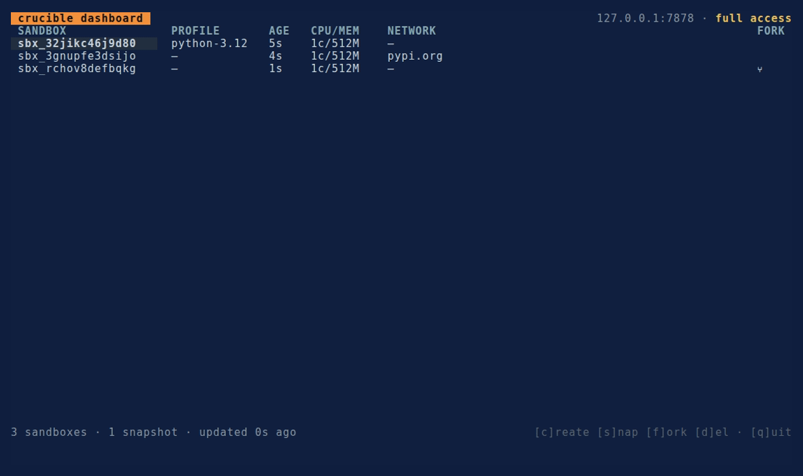

# crucible

> Sandbox runtime for AI coding agents. Firecracker microVMs, a single Go binary, snapshot/fork as first-class primitives.




<p align="center"><em>The <code>crucible tui</code> control center — live sandboxes, the fork tree, and streaming <code>exec</code> against a running daemon (<a href="docs/tui.md">docs</a>).</em></p>

AI coding agents write code and want to run it — check it compiles, run the tests they just wrote, try three approaches in parallel. Today's options are all wrong in different ways: raw Docker (shared kernel, weak isolation, no fork), hosted sandbox services (lock-in, usage-priced), or rolling your own Firecracker stack (months of operational work).

**crucible is the fourth option:** a single self-hosted Go binary on top of Firecracker, with snapshot/fork as first-class primitives, sane defaults, and observability baked in — tuned for running AI-generated code. Full motivation and design: [docs/VISION.md](docs/VISION.md).

**Think of it as a safe `docker run` for code you don't trust.** The moment you'd reach for `docker run` on a random repo, a dependency you haven't audited, or something an agent just wrote — reach for `crucible run` instead. You get a real guest kernel (a container escape is a VM escape), **default-deny egress** (the code can't phone home unless you allow-list the host), and one-command **fork** to explore three approaches in parallel. Boot an unmodified OCI image, poke at it with a real interactive shell, and tear it down:

```bash
crucible run nginx:alpine -p 8080:80     # boot an image, publish a port — long-lived
crucible shell <id>                       # a real /bin/sh into it (cd/env persist)
crucible run --net-allow pypi.org --profile python-3.12 -- pip install requests   # egress only to pypi
```

> **Ephemeral by design (v0.3.0).** Sandboxes are *consciously ephemeral* — a daemon restart does **not** resurrect running sandboxes (their registry records and durable logs persist; the live VMs do not). That is exactly the right contract for "run a sketchy repo, test it, tear it down." Durable, self-healing long-lived workloads are v0.4.

## Highlights

- **Real isolation, not containers.** Every sandbox is a Firecracker microVM under [jailer](https://github.com/firecracker-microvm/firecracker/blob/main/docs/jailer.md) — its own chroot, mount/PID namespaces, and a dropped uid. Not a shared kernel.
- **Snapshot & fork as primitives.** Run setup once, snapshot the warm state, fork *N* parallel children from it. Forks restore with **lazy `userfaultfd` memory** — guest RAM is served from the snapshot on demand, never byte-copied per fork (the AWS Lambda SnapStart technique).
- **Clone-safety.** Each fork wakes with a fresh kernel RNG seed, a rotated `machine-id`, and its own hostname — ordered *before* the fork is reachable — so no two forks silently share UUIDs, secrets, or entropy.
- **Default-deny networking.** No egress unless you allowlist hostnames, and only those — resolved IPs are range-filtered so a guest can't SSRF cloud metadata or private ranges. Enforced in host nftables + a DNS proxy the guest is forced through.
- **Three ways to drive it.** A [CLI](docs/cli.md), a live [TUI dashboard](docs/tui.md), and an [MCP server](docs/mcp.md) — all thin clients over one REST API, so they can't drift.
- **Scoped tokens.** Bind an API key to a policy the daemon enforces (allowed operations, egress ceiling, profile allowlist, resource caps, expiry). See [docs/policy.md](docs/policy.md).
- **Observability.** Per-exec structured results — exit code, wall-clock, and CPU/memory/I/O usage — plus a Prometheus `/metrics` endpoint.
- **Self-hosted, single binary.** Daemon and CLI are one Go binary. No cloud, no account, no telemetry.

> **Maturity.** crucible is pre-1.0 and **not yet hardened for production or untrusted multi-tenant use.** The daemon binds loopback by default, with optional bearer-key auth (required, plus TLS, to bind a non-loopback address). Don't point it at anything you can't afford to lose yet — see [SECURITY.md](SECURITY.md) for the exact isolation model and its limits.

## Quick start

crucible splits into a **Linux daemon** (it needs KVM + Firecracker, so it's Linux-only) and a **cross-platform client** — the CLI, TUI, and `crucible mcp serve` are thin HTTP clients, so they run on macOS and Windows too. Pick your path:

| Your machine | What you install | How |
|---|---|---|
| **Linux with KVM** (`ls /dev/kvm` works) | the **daemon** (client included) | `curl -fsSL …/install.sh \| sudo bash` |
| **macOS / Windows** (or any box driving a remote daemon) | the **client** only | `curl -fsSL …/install.sh \| sh -s -- --client --addr https://HOST:7878 --token <key>` |

> **On a Mac?** Firecracker needs Linux + KVM, and nested virtualization on Apple Silicon is unreliable — so instead of a local Linux VM, run the **daemon** on a Linux box (a cheap cloud VM, a homelab machine, a Linux desktop) and install the **client** on your Mac. `crucible mcp serve` then drives it from Claude Code / Cursor with no local VM. The daemon installer's `--connect-token` mints a scoped key and prints the exact client one-liner + MCP snippet to paste on your Mac.

### Linux daemon

Prebuilt Linux/amd64 binaries and native rootfs profile images ship with each [release](https://github.com/gnana997/crucible/releases). The installer can fetch every dependency for you — a pinned firecracker + jailer, a guest kernel, and a default rootfs, all checksum-verified — with `--with-deps`, and start the service with `--enable`:

```bash
curl -fsSL https://raw.githubusercontent.com/gnana997/crucible/main/install.sh | sudo bash -s -- --with-deps --enable
```

That's the whole daemon on a host with KVM (`ls /dev/kvm` succeeds). Prefer to wire it up by hand? The explicit steps:

**1. Firecracker + jailer** — crucible drives them but doesn't bundle them:

```bash
curl -fsSL https://github.com/firecracker-microvm/firecracker/releases/download/v1.16.1/firecracker-v1.16.1-x86_64.tgz | tar xz
sudo install -m0755 release-v1.16.1-x86_64/firecracker-v1.16.1-x86_64 /usr/local/bin/firecracker
sudo install -m0755 release-v1.16.1-x86_64/jailer-v1.16.1-x86_64      /usr/local/bin/jailer
```

**2. Install the crucible daemon** — downloads the release binary (checksum-verified) and installs the systemd service + config template:

```bash
curl -fsSL https://raw.githubusercontent.com/gnana997/crucible/main/install.sh | sudo bash
```

**3. A guest kernel + a rootfs image** at the paths the config expects:

```bash
sudo curl -fL -o /var/lib/crucible/vmlinux \
  https://s3.amazonaws.com/spec.ccfc.min/firecracker-ci/v1.11/x86_64/vmlinux-6.1.102
sudo curl -fL -o /var/lib/crucible/profiles/python-3.12.ext4 \
  https://github.com/gnana997/crucible/releases/latest/download/python-3.12.ext4
sudo ln -sf profiles/python-3.12.ext4 /var/lib/crucible/rootfs.ext4   # the default rootfs
```

**4. Enable lazy fork** (`userfaultfd` for jailed Firecracker) and start the service:

```bash
echo 'vm.unprivileged_userfaultfd=1' | sudo tee /etc/sysctl.d/99-crucible.conf && sudo sysctl --system
sudo systemctl enable --now crucible
journalctl -u crucible -f      # watch it come up (Ctrl-C to stop watching)
```

The default `/etc/crucible/crucible.env` already points at those paths, so no edits are needed. Then:

```bash
crucible run --profile python-3.12 -- python3 -c 'print("hello from crucible")'
crucible tui        # or open the live dashboard
```

Prefer to build from source? See [Build from source](#build-from-source).

### macOS / Windows client

Install just the client (no root, no VM) and point it at your Linux daemon:

```bash
curl -fsSL https://raw.githubusercontent.com/gnana997/crucible/main/install.sh \
  | sh -s -- --client --addr https://YOUR-LINUX-HOST:7878 --token <key>

crucible sandbox ls        # now talks to the remote daemon
```

Get `<key>` from the daemon host with `crucible daemon token add` — or let the daemon installer's `--connect-token` mint a scoped one and print this exact line for you. To drive it from an agent, add `crucible mcp serve` as an MCP server in Claude Code / Cursor with `CRUCIBLE_ADDR` + `CRUCIBLE_TOKEN` in its environment.

## Usage

crucible is daemon-authoritative: the daemon owns all sandbox logic, and every interface is a thin client over its REST API. Point any of them at a daemon with `--addr` (or `CRUCIBLE_ADDR`; default `127.0.0.1:7878`) and `--token` for an authenticated one.

**CLI** — [full reference](docs/cli.md):

```bash
# Docker-parity: boot an OCI image, publish a port. Long-lived by default.
crucible run nginx:alpine -p 8080:80         # → prints a sandbox id; curl localhost:8080
crucible shell <id>                          # a real interactive shell inside it (no PTY)
crucible stop <id> ; crucible rm <id>        # graceful stop; then remove

# Build a repo's Dockerfile and run it in two lines:
crucible build -t myapp . && crucible run myapp -p 3000:3000

# One-shot: create a sandbox, run a command, delete it. The command's exit code propagates.
crucible run --profile python-3.12 -- python3 -c 'print(2**10)'

# Or drive the lifecycle explicitly, with snapshot + fork:
SBX=$(crucible sandbox create --memory 1024 --profile python-3.12)
crucible sandbox exec $SBX -- pip install requests   # streams stdout/stderr live
SNP=$(crucible snapshot create $SBX)                  # freeze the warm state
crucible fork $SNP --count 5                          # 5 parallel children from it
crucible sandbox ls                                   # table of live sandboxes
```

Add `-o json` to any command for machine-readable output.

**The 30-second demo** — run untrusted code, prove it's boxed in:

```bash
SBX=$(crucible run some/untrusted-image -p 8080:80)   # 1. boot it, publish a port
curl localhost:8080                                    # 2. reach the service on localhost
crucible sandbox exec $SBX -- curl -sS https://example.com   # 3. egress DENIED (no allowlist)
crucible snapshot create $SBX | xargs crucible fork --count 3 # 4. fork it 3× to explore in parallel
```

**TUI** — `crucible tui` opens a live terminal dashboard: running sandboxes, the fork tree, and interactive streaming `exec`, with create/snapshot/fork/delete gated on the token's scope. [Reference](docs/tui.md).

**MCP** — `crucible mcp serve` exposes crucible to any [MCP](https://modelcontextprotocol.io) agent (Claude Code, Cursor, …) as native tools, with operator guardrails. [Reference](docs/mcp.md).

**Raw HTTP** — everything above is the daemon's REST API: endpoints, the exec frame protocol, and error codes are in [docs/api.md](docs/api.md).

## How it works

A single Go binary is both the daemon and the CLI; each guest runs a small vsock agent. The daemon boots Firecracker microVMs under jailer, runs commands over vsock with streamed output, captures snapshots, and forks end-to-end — each fork restored with lazy `userfaultfd` memory, its own netns + DHCP-assigned IP behind a default-deny allowlist, and a per-fork identity refresh. A durable registry is journaled and reconciled on restart (orphaned VMs / netns / nft rules are reaped). The full walkthrough is in [docs/architecture.md](docs/architecture.md); networking has its own [design doc](docs/network.md).

## Build from source

Requirements: a Linux host with KVM (`/dev/kvm`), Go 1.25+, a Firecracker **v1.15+** binary, an uncompressed guest kernel (`vmlinux`), and a rootfs image. Full setup — including the KVM/jailer host requirements and `sysctl` for lazy fork — is in [CONTRIBUTING.md](CONTRIBUTING.md).

```bash
git clone https://github.com/gnana997/crucible && cd crucible
make build     # daemon + CLI  → ./crucible
make agent     # guest agent (static linux/amd64) → ./bin/crucible-agent
```

Run the daemon in development mode (direct Firecracker, no sudo, no jailer — no snapshot/fork):

```bash
./crucible daemon --firecracker-bin /path/to/firecracker --kernel /path/to/vmlinux --rootfs assets/rootfs.ext4
```

…or production-style with jailer chroot + per-sandbox networking (needs root). **Fork is supported only in jailer mode.**

```bash
sudo ./crucible daemon \
  --firecracker-bin /path/to/firecracker --jailer-bin /path/to/jailer \
  --kernel /path/to/vmlinux --rootfs assets/rootfs.ext4 \
  --chroot-base /srv/jailer --network-egress-iface eth0
```

> **Fork cost depends on your filesystem.** Fork memory is lazy (not copied), but the per-fork **rootfs** is cloned via `FICLONE` reflink (O(1)) — and **ext4 has no reflink**, so on ext4 each clone is a full byte-copy. Put `--work-base` on XFS (`reflink=1`) or btrfs for cheap fork.

Make targets: `build`, `agent`, `rootfs`, `profile`, `test`, `race`, `vet`, `fmt`, `lint`, `tidy`, `clean`. Contribution setup, the code map, and end-to-end smoke tests are in [CONTRIBUTING.md](CONTRIBUTING.md); dependencies and package layout in [docs/architecture.md](docs/architecture.md).

## What you get

**Isolation** — every sandbox is a Firecracker microVM under jailer (chroot + mount/PID namespaces + a dropped uid), with cgroup v2 quotas and per-request vCPU/memory/fork ceilings. A real VM boundary, not a shared kernel.

**Snapshot & fork** — freeze warm state, then fork *N* children that restore with lazy `userfaultfd` memory (no guest RAM copied per fork) and a copy-on-write rootfs. Clone-safety reseeds each fork's RNG and rotates its machine-id before it's reachable.

**Networking** — default-deny egress; a per-sandbox hostname allowlist enforced in host nftables + a DNS proxy, with resolved IPs range-filtered against SSRF to metadata/private ranges.

**Drive it your way** — a [CLI](docs/cli.md), a live [TUI](docs/tui.md), and an [MCP server](docs/mcp.md), all thin clients over one REST API. Bind an API key to a daemon-enforced [scoped policy](docs/policy.md).

**Observability** — every exec returns a structured result (exit, timing, and 7 CPU/memory/I/O counters); a Prometheus `/metrics` endpoint and JSON logs. Durable per-sandbox activity logs are next.

**Operate it** — one static Go binary; a durable registry reconciled on restart (no leaked VMs, netns, or nft rules); an install script + systemd unit.

> **By the numbers:** one static binary · no guest RAM copied per fork · 3 interfaces (CLI · TUI · MCP) · 11 MCP tools · 8 prebuilt profiles · 9 direct deps · 512 MB / 1 vCPU / 60 s safe defaults

### Performance

Measured on one 24-core box, 512 MiB sandboxes. The `--work-base` filesystem is the biggest lever — reflink (btrfs/XFS) makes fork's rootfs clone O(1), ext4 copies it — so here's both. Full methodology + distributions in [docs/benchmarks.md](docs/benchmarks.md):

| | ext4 (common default) | btrfs / XFS (reflink) |
|---|---|---|
| Fork (warm → child) | ~690 ms | **~207 ms** |
| Fork throughput (64-way) | 3.7/s | **45/s** |
| 128 forks, host RAM | 4.9 GB | **1.2 GB** (vs 64 GB naïve copy) |
| Exec roundtrip | ~3 ms | ~3 ms |

Fork is **~9× faster than a cold boot** either way, and we ran **512 concurrent microVMs** on the laptop (reflink, RAM-bound).

*Full shipped-vs-planned capability matrix: [docs/ROADMAP.md](docs/ROADMAP.md).*

## Roadmap

- **v0.1** — core runtime: Firecracker + jailer, snapshot/fork with lazy memory, clone-safety, default-deny networking, durable registry, CLI, native profiles, `/metrics`, cgroup quotas, install/systemd, an MCP server, and daemon API-key auth.
- **v0.1.3** — daemon-enforced **scoped / policy tokens**.
- **v0.2.0** — a **TUI** (`crucible tui`), plus fork lineage on the API (`source_snapshot_id`).
- **v0.3.0** (current) — **the safe `docker run` for untrusted/AI code**: OCI image boot + `crucible build`, an interactive `crucible shell` + TUI session view, `--disk` sizing, top-level `stop`/`rm`, durable logs, and MCP image/publish/logs tools. Sandboxes are **ephemeral** (durability is v0.4).
- **v0.3.x** (next) — **`crucible cp`**: copy files into (and out of) a running sandbox, so you can drop code into a `python`/`node`/`go` sandbox and run it with no image build — the agentic iteration loop, minus the Dockerfile.
- **v0.4** (planned) — durable, self-healing long-lived workloads (an app model that survives daemon restart), plus a PTY for full-terminal interactive sessions.

Longer-term direction lives in [docs/ROADMAP.md](docs/ROADMAP.md).

## Security

crucible runs untrusted code, so isolation is a core property — but it is **pre-1.0 and not yet hardened for production or untrusted multi-tenant use.** The daemon binds loopback by default and ships with optional bearer-key auth (required, with TLS, to bind a non-loopback address). See [SECURITY.md](SECURITY.md) for the isolation model, current caveats, and how to report a vulnerability.

## Contributing

Early days — the API is stabilizing. If you're building a coding agent and want crucible to fit your workflow, open an issue describing it; concrete use cases shape priorities more than wishlists. Build/test setup, style, and PR guidelines are in [CONTRIBUTING.md](CONTRIBUTING.md); the codebase walk-through is in [docs/architecture.md](docs/architecture.md). By participating you agree to the [Code of Conduct](CODE_OF_CONDUCT.md).

## License

Apache License 2.0. See [LICENSE](LICENSE).
