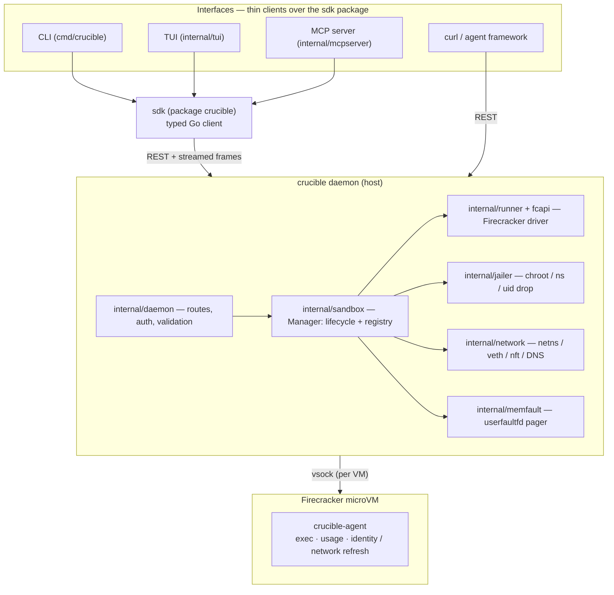
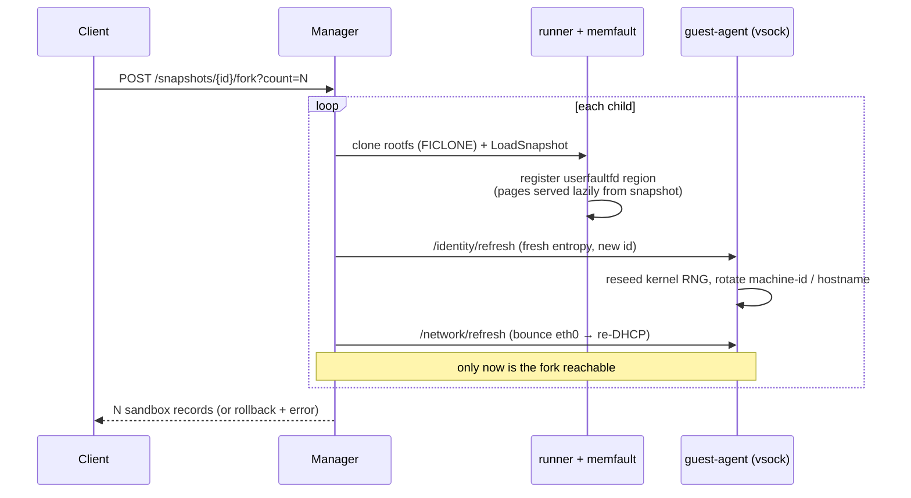

# Architecture

How crucible is put together, for people reading or contributing to the code. For *why* it's shaped this way, see [VISION.md](VISION.md); for the isolation model and its limits, see [SECURITY.md](../SECURITY.md).

crucible is a **single-host daemon**. You run one `crucible daemon` process on a Linux box; it exposes an HTTP API and manages Firecracker microVMs on that host. There is no cluster, no control plane, no external datastore — state lives in memory plus a small on-disk journal, and is rebuilt from that journal on restart.

## The two binaries

crucible is two programs that talk over a [vsock](https://man7.org/linux/man-pages/man7/vsock.7.html) socket:

- **`crucible` (the daemon)** runs on the host. It drives Firecracker, owns networking and snapshots, and serves the public HTTP API. Built from `cmd/crucible`.
- **`crucible-agent` (the guest agent)** runs as PID-adjacent init *inside* each microVM. It executes commands, collects resource usage, and applies per-fork identity refresh. Built from `cmd/crucible-agent`, statically linked for `linux/amd64`, and baked into the rootfs image.

The host never runs guest code directly — it hands an `ExecRequest` to the agent over vsock and streams framed output back. The VM boundary is always between the daemon and the code it runs.

## Packages

**Entry points & interfaces** — the CLI, TUI, and MCP server are all thin clients over one typed client, so they can't drift from each other or the daemon:

| Package | Responsibility |
|---|---|
| `cmd/crucible` | Entry point: the `daemon` subcommand and the client subcommands (`sandbox`, `app`, `snapshot`, `fork`, `run`, `profile`, `policy`, `mcp`, `tui`, `version`) |
| `cmd/crucible-agent` | Guest agent: `/exec`, usage collection, `/identity/refresh`, `/network/refresh` |
| `sdk` | The public Go SDK (package `crucible`, its own Go module): typed client for the daemon's REST API — the CLI, MCP server, TUI, and external programs all sit on it |
| `sdk/api` | Shared REST wire types (used by both the daemon and the SDK) |
| `internal/tui` | Live terminal dashboard (`crucible tui`) — Bubble Tea; a thin consumer of the SDK |
| `internal/mcpserver` | MCP server (`crucible mcp serve`) — thin wrapper over the SDK + operator guardrails |

**Daemon internals:**

| Package | Responsibility |
|---|---|
| `internal/daemon` | HTTP server, routing, middleware, auth, request/response validation |
| `internal/sandbox` | `Manager` — the core lifecycle: create, exec, snapshot, fork, delete, and the durable registry |
| `internal/app` | Durable-app control plane (v0.4): a bbolt store of app **desired state** + a reconcile loop that boots/heals/re-creates an instance (a sandbox) per app — the layer that makes a workload survive a daemon restart. Sits *above* `internal/sandbox`; the daemon supplies the instantiator |
| `internal/runner` | Firecracker driver: boot, snapshot, load, resume, rootfs patch — the load→vsock→rootfs→resume ordering lives here |
| `internal/fcapi` | Thin typed client for the Firecracker REST API over its control socket |
| `internal/jailer` | Builds the jailer argv (chroot, namespaces, uid drop) when running jailed |
| `internal/network` | Per-sandbox netns, veth/tap, nftables program, hostname allowlist, subnet allocator, and the DNS proxy (+ `dhcp/`, `dnsproxy/`) |
| `internal/memfault` | `userfaultfd` pager that serves guest memory lazily from a snapshot file on fork |
| `internal/tokenstore` | API-key store (SHA-256-hashed bearer keys) + runtime verifier |
| `internal/policy` | Scoped-token policy model + enforcement (operations, egress, profiles, resource caps) |
| `internal/metrics` | Prometheus `/metrics` collectors |
| `sdk/wire` | The public wire contract: exec request/result messages, service + file-transfer shapes, and the binary frame codec — shared by the REST API, SDK clients, the daemon, and the guest agent |
| `internal/agentwire` | The private half of the daemon↔guest-agent protocol: vsock transport handshake, fork identity refresh, static network config |
| `internal/agentapi` | Host-side client that speaks to the guest agent over vsock |

## Request lifecycles

### Create a sandbox

`POST /sandboxes` → `sandbox.Manager.Create`:

1. Validate and default the config (vCPUs, memory, timeout, optional network policy).
2. Allocate a workdir; if `--jailer-bin` is set, build the jailer chroot and drop privileges.
3. If a network policy is attached, set up the per-sandbox netns, veth/tap, nftables rules, and register the allowlist with the DNS proxy (see [network.md](network.md)).
4. Boot the microVM via `internal/runner` → `internal/fcapi`, attaching the kernel, rootfs, and a vsock device.
5. Wait for the guest agent's `/healthz` (unless `--no-wait-for-agent`), then record the sandbox in the registry.

Failure at any step rolls back the work done so far (the codebase uses a disciplined `success bool` + deferred-cleanup pattern), so a failed create leaves nothing behind.

### Exec a command

`POST /sandboxes/{id}/exec` streams. The daemon commits to a `200` and then relays a **frame stream** straight from the guest agent:

- Each frame is an 8-byte header (1 type byte + 3 reserved + a big-endian `uint32` payload length) followed by the payload.
- Frame types: `1` stdout, `2` stderr, `3` exit.
- stdout/stderr arrive as data frames as the command runs; the terminal exit frame carries the `ExecResult` JSON (exit code, timing, signal, timeout/OOM flags, and resource usage).

Because the body is committed before the command finishes, post-`200` failures (agent unreachable, connection dropped) are reported *in-band* as a synthesized exit frame with `exit_code: -1` rather than an HTTP error — the framing contract always holds.

### Snapshot and fork

`POST /sandboxes/{id}/snapshot` pauses the VM and writes a snapshot (a state file + a guest-memory file) to disk, then registers it.

`POST /snapshots/{id}/fork?count=N` creates N sandboxes from that snapshot. For each child:

1. The rootfs is cloned copy-on-write.
2. The VM is restored from the snapshot. Guest memory is **not** copied up front — `internal/memfault` registers a `userfaultfd` region and serves pages lazily from the snapshot's memory file as the guest touches them, so N forks share the backing file instead of each paying a full RAM copy.
3. Before the fork is reachable, **clone-safety** runs: the daemon pushes fresh host entropy and a new sandbox ID over vsock (`/identity/refresh`), so the guest reseeds its kernel RNG and rotates its machine identifiers. No two forks wake sharing RNG state, UUIDs, or machine-id.

### Reconcile a durable app

`internal/app` holds each app's **desired state** in a bbolt store and runs a level-triggered reconcile loop that converges the actual instance toward it (see [apps.md](apps.md)). On daemon start — *after* the sandbox reap above has torn down the previous run's VMs — the loop boots a fresh instance for every desired-running app from its stored spec, which is how an app survives a restart (re-created, not re-attached). While running it restarts a dead or unhealthy instance with exponential backoff + a crash-loop guard, and probes http/tcp health checks. The app's instance is an ordinary sandbox created through the same path a `POST /sandboxes` uses (the daemon supplies `internal/app` an *instantiator* over `sandbox.Manager`), so exec/logs/snapshot work on it unchanged.

Fork is all-or-nothing: a failure partway through rolls back every child already started, so the response is either all N sandboxes or an error.

## State and durability

The `Manager` holds live sandbox and snapshot state in memory, and mirrors lifecycle events to an append-only journal on disk. On daemon restart it **reconciles**: it replays the journal, re-adopts state that is still valid, and cleans up what isn't (orphaned workdirs, dead VMs). This is what lets the daemon restart without leaking host resources — but note it is single-host state only; there is no shared or replicated store.

## Networking model (brief)

A networked sandbox lives in its own network namespace with a `/30` carved from `--network-subnet-pool`. Egress is **default-deny**: the guest can only reach IP addresses the host-side DNS proxy resolved for explicitly allowlisted hostnames, and those resolved addresses are range-filtered to block link-local, RFC1918, and CGNAT ranges (closing SSRF paths to cloud-metadata endpoints). nftables enforces the forwarding rules and an ingress filter with per-sandbox source anti-spoofing. The full walk-through is in [network.md](network.md).

## Jailer mode

With `--jailer-bin` set, each Firecracker VMM runs under the [jailer](https://github.com/firecracker-microvm/firecracker/blob/main/docs/jailer.md): its own chroot, mount and PID namespaces, and a dropped uid. A compromised VMM is confined to its jail. Snapshot/fork is supported only in jailer mode, because the per-fork artifact staging that keeps forks from mutating a shared image is built around the jail layout.

**Teardown kills the whole VM process set, not just the jailer.** With a fresh PID namespace (`--new-pid-ns`, the default) firecracker is a *child* of the jailer, so signalling the jailer alone leaves firecracker orphaned to init — a leaked microVM that also keeps its cgroup populated. On delete, crucible kills both the jailer and the firecracker child (matched by the `--id` token in their cmdlines) and waits for them to drain before removing the chroot and cgroup; the startup reconcile reaps any that a crash left behind. The jailer's drop-gid also defaults to the host's `kvm` group so the jailed firecracker can open `/dev/kvm` without a manual ACL.

## What isn't here yet

crucible is pre-1.0. The daemon supports optional bearer-key auth and daemon-enforced scoped tokens (off by default on loopback); there is no per-sandbox activity log / audit trail beyond operational logs yet; and per-sandbox OCI images are stubbed (`501`). See [ROADMAP.md](ROADMAP.md) for what's planned and [SECURITY.md](../SECURITY.md) for the honest limits.
