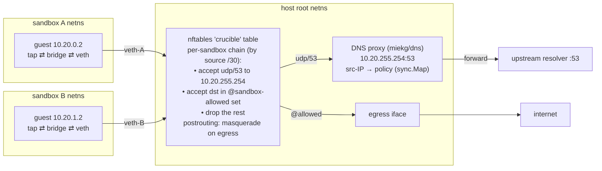
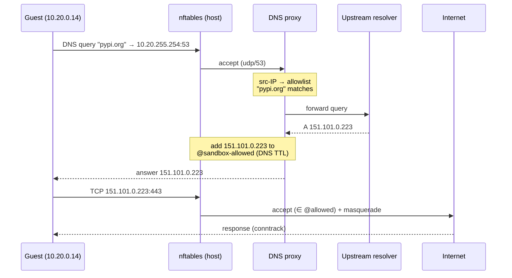

# The network model

This page is the implementation-level companion to [Networking](../network.md): how the policy you configure is enforced, deliberately concrete. For the higher-level "why network isolation", see [VISION.md](../VISION.md).

## Design goals

1. **Default-deny.** A sandbox with no network config gets no NIC attached and zero egress reachability.
2. **Hostname allowlist override.** An allowlisted sandbox can reach exactly those hostnames (A/AAAA records only) over any TCP/UDP port. Everything else is dropped: ICMP to arbitrary hosts, egress to IP literals, connections to ports on resolved IPs the proxy did not answer for.
3. **Broader egress without weakening the SSRF guard.** Full egress and CIDR allowlists widen reach, but the public-unicast-only invariant holds in every mode. The nft drop list (`network.BlockedEgressPrefixes`) is unit-tested to agree with the DNS-layer `IsPublicUnicast` guard, so the two cannot drift.
4. **Enforcement on the host kernel.** Policy lives in the host's nftables and a host-side DNS proxy the guest is forced to use. The guest is untrusted: if user code escalates to root and tears down guest-side firewall rules, the host rules still block egress.
5. **Per-sandbox isolation.** Sandbox A cannot see, reach, or influence sandbox B's traffic, even when both allowlist overlapping destinations.
6. **Clean lifecycle.** Create, use, delete leaves no orphan namespaces, veth pairs, nftables state, or DNS proxy entries. Daemon-crash recovery wipes stale per-sandbox network state on startup.

## Non-goals

Deliberate exclusions, not oversights:

- **IPv6.** All allocation and rules are IPv4-only (deferred).
- **Reaching private ranges.** No opt-in exists for RFC1918, link-local, or metadata egress. Private inter-app networking is separate future work, under a tenancy model.
- **Port allowlists** (`pypi.org:443`). Any port to allowed IPs; ports are not constrained.
- **Protocol allowlists.** TCP, UDP, and ICMP are all allowed to allowed IPs.
- **Egress rate limiting.**
- **Packet capture and traffic logging**: a planned item (`crucible sandbox tcpdump`, see [ROADMAP.md](../ROADMAP.md)).
- **Bring-your-own-DNS.** All sandboxes share the same upstream resolver.
- **A separate DNS-proxy process.** The proxy runs in-process in the daemon.

## Architecture

Every sandbox routes DNS to one shared host-side proxy and egresses through one shared nftables table. The guest's source IP, unique because every sandbox owns its own `/30`, is the key that maps a packet to its policy.

**The DNS anycast IP.** The daemon reserves `10.20.255.254` inside the subnet pool as a host-side address, bound to a `crucible-dns` dummy interface in the host root netns. Every sandbox gets a route `10.20.255.254/32 via <its own gateway>`, so DNS queries traverse the veth into the host root netns and land on the single shared listener. The source IP of the incoming packet identifies the sandbox unambiguously; an O(1) `sync.Map` lookup maps it to that sandbox's policy.

Each sandbox gets:

- **Its own network namespace** on the host (`crucible-<id>`).
- **A veth pair**: one end (`veth-<id>-h`) stays in the host root netns; the other (`veth-<id>-g`) moves into the sandbox netns.
- **A bridge inside the netns** joining the guest's `tap-<id>` (Firecracker's NIC) to `veth-<id>-g`, so the guest and the host-side veth share one L2 segment.
- **A `/30` from the `10.20.0.0/16` pool.** The host-side veth holds the first usable address (the guest's gateway), the guest the second. DNS points at the shared anycast `10.20.255.254`.

Three shared host resources are allocated once at startup: the `crucible-dns` dummy interface, the DNS proxy (one UDP listener, policies keyed by guest source IP in a `sync.Map`, no mutex on the hot path), and a single nftables `inet` table named `crucible` containing a per-sandbox set of allowed IPs and a per-sandbox chain of filter rules.

## Per-sandbox setup (on `Manager.Create`)

Order matters: each step assumes the previous succeeded, and a failure triggers rollback that unwinds in reverse.

1. **Allocate a `/30` from the pool.** A bitmap in the network Manager; create is rejected if exhausted (cap of roughly 16K concurrent sandboxes).
2. **Create the network namespace** `crucible-<sandbox-id>`.
3. **Create the veth pair** and move `veth-<id>-g` into the sandbox netns.
4. **Assign IPs and bring links up.** The host-side veth gets the gateway address; the guest side is configured via DHCP (below).
5. **Create the `tap-<id>`** inside the sandbox netns for Firecracker to attach to.
6. **Bridge inside the netns**, joining `veth-<id>-g` and `tap-<id>` so the guest and the gateway sit on one L2 segment.
7. **Register in the nftables `crucible` table**: an IP set `sandbox-<id>-allowed` (with per-entry timeouts) and a chain that accepts DNS to the proxy, accepts destinations in the allowed set, and drops everything else. A single shared postrouting masquerade rule NATs all sandboxes.
8. **Register with the DNS proxy**: queries from that source IP are now filtered against the allowlist.
9. **Tell jailer to use this netns** (`--netns /var/run/netns/crucible-<id>`); Firecracker joins it on exec.
10. **Configure Firecracker's NIC** with the tap and a generated guest MAC. The guest's IP, gateway, and DNS are handed out over DHCP by a per-netns responder, so the rootfs needs no per-sandbox baking.

## Guest IP configuration: DHCP, and the fork refresh

**In the guest, systemd-networkd is the DHCP client.** The crucible rootfs ships a small netplan config telling it to DHCP on eth0; that is the entire guest-side setup. On initial boot the per-netns responder answers DISCOVER/REQUEST with the sandbox's pre-assigned IP, gateway, and DNS. The responder is hand-rolled (one MAC, one lease, short TTL) and enters the target netns before binding UDP/67.

**On fork, the address must change.** A snapshot captures the source's eth0 config, which is unreachable from the fork's new netns; without intervention the guest is dark until the next DHCP renewal. So `crucible-agent` exposes `POST /network/refresh` over vsock, which `Manager.Fork` invokes immediately after resume:

1. `ip link set eth0 down`: the kernel flushes eth0's config.
2. `ip link set eth0 up`: systemd-networkd sees the link-up event and starts a fresh DHCP cycle.
3. The agent polls for a non-link-local IPv4 and returns once the new address is configured.

This adds roughly one DHCP round-trip (100-300 ms) to fork cost, invisible next to snapshot-restore overhead. If the guest requests its stale IP, the responder NAKs, forcing a DISCOVER onto the correct address. If the agent is unreachable, fork logs a warning and moves on; the guest recovers on its own renewal cycle.

## Packet flow

The allowed path: a DNS lookup that populates the nftables set, then egress to the attested IP.

Walking the cases:

- **Allowed DNS query.** The proxy maps source IP to allowlist; on a match it forwards upstream, adds the answered IP to `sandbox-<id>-allowed` with a TTL from the DNS answer (clamped to a floor), and returns the response.
- **Allowed connection.** nftables matches the destination against the set; the packet egresses with masquerade, and conntrack un-masquerades the return path.
- **Denied destination.** Falls through to drop: a silent timeout, no ICMP.
- **Denied DNS query.** `NXDOMAIN`; the guest never connects.
- **IP literal.** No DNS lookup happened, so the IP was never attested: dropped. The allowlist pivots on DNS-attested IPs by design.

**Matching** uses a trie keyed by reversed DNS labels per sandbox: `registry.npmjs.org` looks up `org.npmjs.registry`, matching if a prefix ends in an exact entry or a single-label wildcard at the right depth. O(labels) per query.

## Lifecycle integration

- **`Manager.Create`**: after `jailer.Stage`, before running jailer: allocate the subnet, set up netns/veth/bridge/tap/nftables, register with the DNS proxy, pass the netns path to the runner.
- **`Manager.Delete`**: after the VM handle shuts down: tear down the nftables chain and set, deregister from the DNS proxy, delete the netns (which removes the veth pair). Best-effort and idempotent.
- **`Manager.Snapshot`**: network state is host-side, so snapshots capture none of it.
- **`Manager.Fork`**: each fork gets its own subnet, netns, and veth, and inherits the source's allowlist; the agent refresh above re-addresses the guest.
- **Daemon startup**: an orphan reap lists every `crucible-*` netns and every chain in the `crucible` table left by a prior run and wipes them.

## Failure modes

| Failure | Blast radius | Response |
|---|---|---|
| DNS proxy crashes | All sandboxes lose DNS | Log loudly, kill the daemon; the systemd unit restarts it. Fail-closed beats mystery behavior. |
| `nft` fails during create | One sandbox | Roll back: delete netns, release subnet, return 500. |
| Netns creation fails | One sandbox | Same rollback. |
| Subnet pool exhausted | One sandbox | Reject with a clear error ("no network subnets available; delete some sandboxes"). |
| Guest reaches a non-allowed IP | Expected | Dropped silently; an nft counter increments. |
| Allowlist syntax invalid | One sandbox | Rejected with 400 at create time, before any setup. |
| DHCP responder dies | One sandbox | The guest keeps its lease until expiry. Leases are long to make this rare. |
| A second networked daemon starts | Daemon fails to start | The DNS proxy binds the shared anycast, so two networked daemons collide on it. One networked crucible daemon per host; stop the other or run the second without `--network-egress-iface`. |
