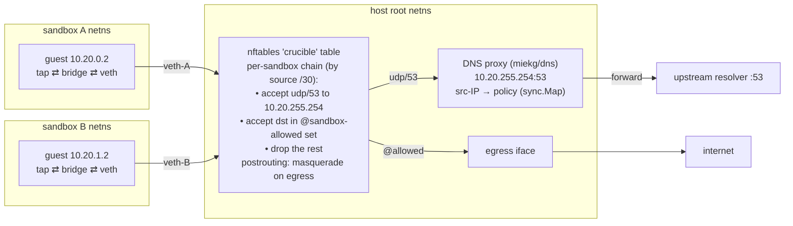
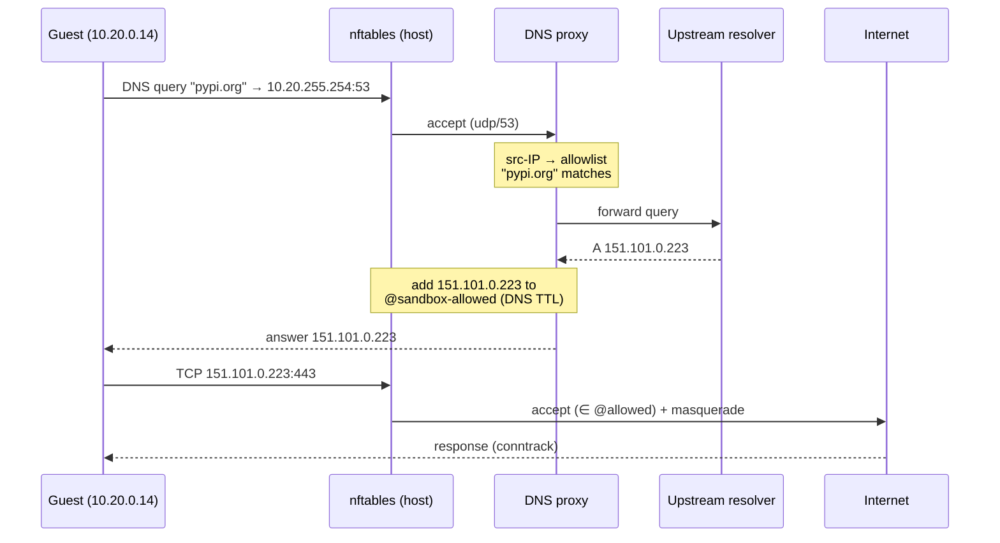

# Network: default-deny with per-sandbox allowlist

> How crucible's per-sandbox networking works — default-deny egress with a hostname allowlist, enforced on the host kernel. The document is deliberately concrete about the implementation. For the higher-level "why network isolation?", see [VISION.md](VISION.md).


*In action: a sandbox created with `--net-allow pypi.org` resolves and reaches pypi.org over HTTPS, while every other host — e.g. `example.com` — is refused at the DNS proxy. The allowlist is the whole reachable surface. (Regenerate with `vhs demo/network.tape`.)*

## Design goals

1. **Default-deny.** A sandbox with no network config gets no NIC attached and zero egress reachability. This is the out-of-the-box experience.
2. **Hostname allowlist override.** A sandbox configured with `network.enabled=true` and an allowlist of hostname patterns can reach exactly those hostnames (A/AAAA records only) over any TCP/UDP port. Everything else — ICMP to arbitrary hosts, egress to IP literals, connections to ports on resolved IPs we didn't answer for — is dropped.
3. **Broader egress for trusted workloads (public-hosts-only).** For an app you deploy yourself, "enumerate every hostname" is the wrong default. Two opt-ins widen egress without weakening the SSRF guard:
   - **Full egress** (`full_egress` / `--net-full-egress`) — reach *any* public host. The DNS proxy answers any name and nftables accepts all destinations **except** the blocked ranges below.
   - **CIDR allowlist** (`allowlist_cidr` / `--net-allow-cidr 203.0.113.0/24`) — reach IP literals in a public prefix directly, which the hostname allowlist can't express.

   The invariant for both: **public unicast only, no exceptions.** Metadata/link-local (`169.254.0.0/16`, incl. `169.254.169.254`), RFC1918, loopback, CGNAT (`100.64.0.0/10`), and the reserved blocks are always dropped — the nft drop list (`network.BlockedEgressPrefixes`) is unit-tested to agree with the DNS-layer `IsPublicUnicast` guard, so the two can't drift. A CIDR overlapping private space has those addresses dropped; a wholly-private CIDR reaches nothing.
4. **Enforcement on the host kernel.** Policy is applied in the host's nftables and a host-side DNS proxy the guest is forced to use. The guest is untrusted — if user code escalates to root and tears down guest-side firewall rules, the host rules still block egress.
4. **Per-sandbox isolation.** Sandbox A cannot see, reach, or influence sandbox B's network traffic, even if both are allowlisted to overlapping destinations.
5. **Clean lifecycle.** Create → use → delete leaves no orphan namespaces, veth pairs, nftables tables, or DNS proxy state. Daemon-crash recovery wipes stale per-sandbox network state on startup.

## Non-goals

These are deliberate exclusions, not oversights:

- **IPv6.** All allocation and rules are IPv4-only (deferred).
- **Reaching private ranges.** There is no opt-in for RFC1918/link-local/metadata egress — the public-only invariant holds for every mode. Private inter-app networking is separate future work (A5), under a tenancy model.
- **Port allowlists** (`pypi.org:443`). Any port to allowed IPs; ports aren't constrained.
- **Protocol allowlists.** TCP, UDP, ICMP all allowed to allowed IPs — no per-protocol filter.
- **Egress rate limiting.** No per-sandbox rate limit.
- **Packet capture / traffic logging** — a planned item (`crucible sandbox tcpdump`, see [ROADMAP.md](ROADMAP.md)).
- **Bring-your-own-DNS** (a per-sandbox upstream resolver). All sandboxes share the same upstream.
- **Policy files.** Configuration is per-request JSON; a `policy.yaml` superset is planned.
- **A separate DNS-proxy process.** The proxy runs in-process in the daemon.

## Architecture

Every sandbox routes DNS to one shared host-side proxy and egresses through one shared nftables table; the guest's source IP — unique because every sandbox owns its own `/30` — is the key that maps a packet to its policy.



**The DNS anycast IP.** The daemon reserves `10.20.255.254` inside the subnet pool as a host-side address, bound to a `crucible-dns` dummy interface in the host root netns. Every sandbox gets a route `10.20.255.254/32 via <its own gateway>`, so DNS queries traverse the veth into host root netns and land on the single shared listener. The source IP of the incoming packet — the guest's address — identifies the sandbox unambiguously, because every sandbox owns a unique `/30`. An O(1) `sync.Map` lookup maps source IP to that sandbox's policy.

Each sandbox gets:

- **Its own network namespace** on the host (`crucible-<id>`).
- **A veth pair**: one end (`veth-<id>-h`) stays in the host root netns; the other (`veth-<id>-g`) moves into the sandbox netns.
- **A bridge inside the netns** joining the guest's `tap-<id>` (Firecracker's NIC) to `veth-<id>-g`, so the guest and the host-side veth share one L2 segment.
- **A `/30` from the `10.20.0.0/16` pool.** Within the block: the host-side veth holds the first usable address (the guest's **gateway**), the guest holds the second (e.g. gateway `10.20.0.13`, guest `10.20.0.14` in block `10.20.0.12/30`). DNS points at the shared anycast `10.20.255.254`.

Three shared host-root-netns resources are allocated once at startup:

- **The `crucible-dns` dummy interface**, carrying the anycast IP `10.20.255.254/32` every sandbox routes DNS to.
- **The DNS proxy**, one UDP listener bound to `10.20.255.254:53` (`miekg/dns` for wire format). Policies keyed by guest source IP in a `sync.Map` — O(1) read path, no mutex on the hot path.
- **A single nftables `inet` table** named `crucible`, containing a per-sandbox set of allowed IPs and a per-sandbox chain of filter rules.

## Per-sandbox setup (on `Manager.Create`)

Order matters — each step assumes the previous succeeded; a failure triggers rollback that unwinds in reverse.

1. **Allocate a `/30` from the pool.** A bitmap in the network Manager; create is rejected if exhausted (cap ~16K concurrent sandboxes).
2. **Create the network namespace** — `crucible-<sandbox-id>`.
3. **Create the veth pair** and move `veth-<id>-g` into the sandbox netns.
4. **Assign IPs and bring links up** — host-side veth gets the gateway address; the guest side is configured via DHCP (below).
5. **Create the `tap-<id>`** inside the sandbox netns for Firecracker to attach to.
6. **Bridge inside the netns.** A bridge joins `veth-<id>-g` and `tap-<id>` so the guest (on the tap) and the host-side veth (`.1` of the `/30`, the gateway) sit on the same L2 segment. The guest reaches the gateway and, through it, the DNS anycast and allowed egress.
7. **Register in the nftables `crucible` table** — an IP set `sandbox-<id>-allowed` (with per-entry timeouts) and a chain `sandbox-<id>`:
   - `iifname "veth-<id>-h" ip daddr 10.20.255.254 udp dport 53 accept` — DNS to the proxy.
   - `iifname "veth-<id>-h" ip daddr @sandbox-<id>-allowed accept` — allowed IPs.
   - `iifname "veth-<id>-h" drop` — everything else from this sandbox.
   The `forward` chain jumps to `sandbox-<id>` when the source matches the sandbox's subnet; a single shared `postrouting` masquerade rule on the egress interface NATs all sandboxes.
8. **Register with the DNS proxy** — `proxy.Register(sandboxID, sourceIP, allowlist)`. Queries from that source IP are now filtered against the allowlist.
9. **Tell jailer to use this netns** — pass `--netns /var/run/netns/crucible-<id>` to the jailer argv; Firecracker joins the netns on exec.
10. **Configure Firecracker's NIC** — `PUT /network-interfaces/eth0` with `host_dev_name=tap-<id>` and a generated guest MAC. The guest's IP/gateway/DNS are handed out over DHCP by a per-netns responder, so the rootfs needs no per-sandbox baking.

### Guest IP configuration: per-netns DHCP + agent-driven refresh on fork

**DHCP client in the guest: systemd-networkd.** Modern Ubuntu/Debian ship systemd-networkd as the default DHCP client. The crucible rootfs ships a small netplan config at `/etc/netplan/60-crucible-eth0.yaml` that tells it to DHCP on eth0 — that's the entire guest-side setup. iproute2's `ip` (for the link-bounce at fork time) is always present.

**Initial boot:** systemd-networkd brings eth0 up, DISCOVERs, and the per-netns responder OFFERs → REQUEST → ACK, configuring eth0. The responder is hand-rolled (one MAC, one lease, short TTL); it enters the target netns via `runtime.LockOSThread` + `unix.Setns(CLONE_NEWNET)` before binding UDP/67, and answers for the sandbox's pre-assigned IP + gateway + DNS (`10.20.255.254`).

**Fork resume:** a snapshot captures the source's eth0 config (its IP, its gateway) — neither reachable from the fork's new netns. Without intervention the guest is "dark" until systemd-networkd's next renewal. crucible fixes this: `crucible-agent` exposes `POST /network/refresh` over vsock, which `sandbox.Manager.Fork` invokes immediately after resume. The agent:

1. `ip link set eth0 down` — the kernel flushes eth0's config.
2. `ip link set eth0 up` — systemd-networkd sees the link-up event and starts a fresh DHCP cycle (DISCOVER, not a renewal of the stale lease).
3. Polls `net.InterfaceByName("eth0")` for a non-link-local IPv4, bounded by the handler timeout — returning once the new address is configured.

This adds roughly one DHCP round-trip (~100–300 ms) to fork cost, invisible next to snapshot-restore overhead. If systemd-networkd REQUESTs the source's stale IP, the responder compares requested-vs-offered and NAKs, forcing a DISCOVER onto the correct address. If the agent is unreachable (VM still booting, vsock not ready), `Manager.Fork` logs a warning and moves on — the guest recovers on systemd-networkd's own renewal cycle.

## Packet flow

The allowed path — a DNS lookup that populates the nftables set, then egress to the attested IP:



Walking the cases:

- **Allowed DNS query.** The guest queries `10.20.255.254:53`. nftables matches `dport 53 accept` and forwards to the proxy. The proxy maps source IP → sandbox → allowlist; `pypi.org` matches, so it forwards to upstream, gets the A record, **adds that IP to `sandbox-<id>-allowed` with a TTL from the DNS answer** (clamped to a floor), and returns the response.
- **Allowed HTTP request.** The guest opens TCP to the resolved IP. nftables matches `ip daddr @sandbox-<id>-allowed accept`; the packet egresses with masquerade, and conntrack un-masquerades the return path.
- **Denied destination.** TCP to an IP nothing resolved to falls through to `drop`. The guest sees a connection timeout — no ICMP unreachable (silent, so probing for reachable hosts gets no signal).
- **Denied DNS query.** A lookup for a non-allowlisted name returns `NXDOMAIN` (not `REFUSED` — less clueful that a filter exists); the guest fails the lookup and never connects.
- **IP literal.** `curl http://93.184.216.34` does no DNS lookup, so that IP was never added to the set — dropped. This is the point of the design: the allowlist pivots on **DNS-attested** IPs, so IP literals never work unless a hostname you resolved answered with that IP.

## Allowlist syntax & matching

Grammar — two rules, case-insensitive:

- **Exact match:** `pypi.org`.
- **Single-label wildcard:** `*.npmjs.org` matches `registry.npmjs.org` and `www.npmjs.org`, but **not** `a.b.npmjs.org` or bare `npmjs.org`.

No regex, no CIDR, no port numbers.

**Matching.** A trie keyed by reversed DNS labels per sandbox's allowlist. `registry.npmjs.org` → look up `org.npmjs.registry`; match if a prefix ends in an exact entry or a single-label wildcard at the matching depth. O(labels) per query.

**Corner cases.**

- Bare `*` is rejected at config time (that's "all internet" and must be requested explicitly).
- Entries are lowercased; trailing dots stripped (`pypi.org.` → `pypi.org`).
- Wildcards only in the first label — `*.foo.*.com` is rejected.

## API shape

```json
POST /sandboxes
{
  "vcpus": 1,
  "memory_mib": 512,
  "network": {
    "enabled": true,
    "allowlist": ["pypi.org", "*.npmjs.org", "github.com", "objects.githubusercontent.com"]
  }
}
```

**Field semantics.**

- `network` absent → no network (equivalent to `{"enabled": false}`).
- `network.enabled = false` → no NIC attached; other network fields ignored.
- `network.enabled = true` with an absent/empty `allowlist` → **400.** An explicit allowlist is required; "full internet" is not a supported config (default-deny ethos — it must be an explicit gesture).
- `network.enabled = true` with a populated `allowlist` → applied per this doc.

**Response.** The sandbox response carries a `network` substruct describing the applied policy:

```json
{
  "id": "sbx_...",
  "network": {
    "enabled": true,
    "allowlist": ["..."],
    "guest_ip": "10.20.0.14",
    "gateway": "10.20.0.13"
  }
}
```

## Lifecycle integration

Where networking plugs into the sandbox lifecycle:

- **`Manager.Create`** — after `jailer.Stage`, before running jailer: allocate the subnet, set up netns/veth/bridge/tap/nftables, register with the DNS proxy, and pass the netns path to the runner.
- **`Manager.Delete`** — after the VM handle shuts down (chroot + cgroup cleanup): tear down the nftables chain/set, deregister from the DNS proxy, and delete the netns (which removes the veth pair). Best-effort and idempotent.
- **`Manager.Snapshot`** — network state is host-side, so snapshots don't capture it. No changes required.
- **`Manager.Fork`** — each fork gets its own subnet/netns/veth and inherits the source's allowlist. The fork's DHCP responder hands it a new IP; because the restored guest kernel holds the source's stale eth0 config, the daemon calls the agent's `/network/refresh` to bounce the link and re-DHCP onto the correct address (see above).
- **Daemon startup (orphan reap)** — list every `crucible-*` netns and every chain in the `crucible` nft table left by a prior run and wipe them, mirroring the jailer orphan reap.

## Failure modes

| Failure | Blast radius | Response |
|---|---|---|
| DNS proxy crashes | All sandboxes lose DNS | Log loudly, kill the daemon; the systemd unit restarts it. (Fail-closed beats mystery behavior.) |
| `nft` command fails during create | One sandbox | Roll back: delete netns, release subnet, return 500. |
| Netns creation fails (EPERM / EBUSY) | One sandbox | Same rollback. |
| Subnet pool exhausted | One sandbox | Reject with a clear error ("no network subnets available; delete some sandboxes"). |
| Guest reaches a non-allowed IP | Expected | Dropped silently; an nft counter increments. |
| Allowlist syntax invalid | One sandbox | Rejected with 400 at create time, before any setup. |
| DHCP responder in the netns dies | One sandbox | The guest keeps its lease until expiry, then loses network. Leases are long to make this rare. |
| A second networked daemon starts on the host | Daemon fails to start | The DNS proxy binds the shared anycast `10.20.255.254:53`, so two networked daemons collide (`bind: address already in use`). **One networked crucible daemon per host** — the `10.20.0.0/16` pool and the anycast IP are host-global. Stop the other (`sudo systemctl stop crucible`) or run the second without `--network-egress-iface`. |

## Testing

- **Unit** (`internal/network/allowlist.go` tests): trie construction, wildcard matching, reject-bad-input, normalization.
- **Unit** (`internal/network/subnet.go` / `bitmap.go` tests): the allocator hands out unique `/30`s, releases them on delete, and rejects exhaustion.
- **Unit** (`internal/network/dnsproxy` tests): an in-process upstream stub exercises allowed / denied / NXDOMAIN-on-no-match / set-update-on-allowed cases.
- **End-to-end** ([smoke_e2e.sh](../scripts/smoke_e2e.sh)): default-deny, allowlisted (allowed / denied / IP-literal / `*.domain`), and per-fork networking against a live daemon.

## Package layout

```
internal/network/
  doc.go              package doc
  manager.go          owns the subnet pool + DNS proxy; wires to sandbox.Manager; orphan reap
  subnet.go           /30 pool
  bitmap.go           allocation bitmap
  netns.go            netns create/delete (shells out to `ip netns`)
  veth.go             veth pair + bridge + tap setup inside the netns
  nft.go              nftables rule emission via `nft -f -`
  allowlist.go        trie + pattern matching
  exec.go             namespaced command execution helpers
  reap.go             startup orphan reap (netns + nft)
  dhcp/               per-netns DHCP responder (responder.go, wire.go)
  dnsproxy/           UDP DNS proxy + upstream forwarding (proxy.go, upstream.go)
```

## Dependencies

- **`golang.org/x/sys/unix`** — netns entry (`Setns`) and syscall work.
- **`github.com/miekg/dns`** — DNS wire format + the upstream client. Chosen over rolling our own after weighing EDNS0, TCP fallback, and CNAME-chain walking against the RFC-1035 machinery it would require; it's used by CoreDNS and ExternalDNS and pulls only `golang.org/x/net`.
- **DHCP is hand-rolled** — the protocol is narrow (one MAC, one lease, two request types) and stable; the responder is ~260 LOC with no library pulled in.
- **No netlink library** — namespace/link/nftables manipulation shells out to `ip` and `nft`. Readable and debuggable; subprocess latency is a non-issue at per-sandbox-create-once granularity.
